<h1 align="center">Hi 👋, I'm Joseph K Anoj</h1>

<h3 align="center">
  Frontend-focused Full Stack Developer
</h3>

  I build scalable, responsive and user-focused web applications with
  <strong>React, Next.js, TypeScript, Node.js and PostgreSQL.</strong>

  
  
  

---

## 👨‍💻 About Me

I'm a **frontend-focused full-stack developer** who enjoys turning complex product requirements into clean interfaces, maintainable architectures and production-ready applications.

My experience spans **SaaS platforms, CMS systems, dashboards, form builders, productivity tools and responsive web applications**.

I care about building software that is:

* 🎨 **Well-designed** — clean, intuitive and accessible interfaces
* ⚡ **Fast** — responsive experiences and performance-conscious architecture
* 🧩 **Maintainable** — reusable components and scalable project structure
* 🔐 **Secure** — authentication, authorization and API security
* 📱 **Responsive** — consistent experiences across devices
* 🚀 **Production-ready** — reliable APIs, data handling and deployment workflows

---

## 🎯 What I Build

  
  
  
  

  
  
  

---

## 🔭 Currently

* 🏗️ Building scalable **SaaS and CMS architectures**
* ⚛️ Developing modern applications with **React, Next.js and TypeScript**
* 🔌 Designing and integrating **REST APIs and backend services**
* 🔐 Improving **authentication, authorization and API security**
* 🎨 Refining **frontend architecture, accessibility and UI/UX**
* 🤖 Exploring **AI-assisted software development workflows**
* 🌍 Open to interesting opportunities with **international and remote-first teams**

---

## 🛠️ Tech Stack

### Frontend

  

### Backend & Databases

  

### UI, Design & Tools

  

---

## 💻 Featured Projects

### 🧠 Quizzie

A full-stack quiz creation and management platform focused on creating interactive quizzes and managing questions through a responsive interface.

**Highlights**

* Quiz creation and management
* Interactive quiz experience
* User authentication
* Dynamic question handling
* Responsive UI

**Stack:** React · Node.js · Express · MongoDB

[🔗 Source Code](YOUR_QUIZZIE_REPOSITORY_URL) · [🌐 Live Demo](YOUR_QUIZZIE_DEMO_URL)

---

### 🏢 CMS & Website Management Platform

A scalable CMS ecosystem for managing websites, content, forms and digital assets through a centralized administration platform.

**Highlights**

* Website management
* Content management
* Form builder
* Form submissions
* Email templates
* Media management
* Role-based access
* API-driven architecture
* Responsive administration interface

**Stack:** React · TypeScript · Material UI · Node.js · REST APIs · PostgreSQL

🔒 **Private / Client Project**

---

### ✅ Task Manager

A productivity application designed around managing tasks and workflows with a responsive full-stack architecture.

**Stack:** React · Node.js · Express · MongoDB

[🔗 Source Code](YOUR_TASK_MANAGER_REPOSITORY_URL) · [🌐 Live Demo](YOUR_TASK_MANAGER_DEMO_URL)

---

### 🤖 Form-Bot

A dynamic form platform for creating, managing and processing structured form submissions.

**Stack:** React · Node.js · Express · MongoDB

[🔗 Source Code](YOUR_FORM_BOT_REPOSITORY_URL) · [🌐 Live Demo](YOUR_FORM_BOT_DEMO_URL)

---

### 📝 Pocket Notes

A lightweight notes application built with a modern React frontend and persistent database storage.

**Stack:** React · Vite · MongoDB

[🔗 Source Code](YOUR_POCKET_NOTES_REPOSITORY_URL) · [🌐 Live Demo](YOUR_POCKET_NOTES_DEMO_URL)

---

## 📊 GitHub Activity

  
  

  <i>GitHub statistics are generated automatically using GitHub Actions.</i>

---

## 🐍 Watch My Contributions Get Eaten

  <picture>
    <source
      media="(prefers-color-scheme: dark)"
      srcset="https://raw.githubusercontent.com/JosuK22/JosuK22/output/snake.svg"
    />
    <source
      media="(prefers-color-scheme: light)"
      srcset="https://raw.githubusercontent.com/JosuK22/JosuK22/output/snake-light.svg"
    />
    
  </picture>

---

## 🤝 Let's Connect

  
  
  

  <strong>Open to interesting engineering opportunities, collaborations and ambitious products.</strong>

  <i>Building products, solving problems, and continuously improving.</i>

