<h1 align="center">Hi 👋, I'm Joseph K Anoj</h1>

<h3 align="center">
  Full Stack Developer · Frontend Specialist · UI/UX Enthusiast
</h3>

  I build modern, scalable and user-focused web applications with
  <strong>React, Next.js, TypeScript, Node.js and PostgreSQL.</strong>

  
  
  

---

## 👨‍💻 About Me

I'm a developer who enjoys turning ideas into polished, production-ready web applications.

My focus is on building products that combine:

* 🎨 Clean and thoughtful UI/UX
* ⚡ Fast and responsive frontend experiences
* 🧩 Maintainable component architecture
* 🔐 Secure authentication and authorization
* 🔌 Well-structured REST APIs
* 🗄️ Scalable database design
* 📱 Responsive experiences across devices
* 🚀 Performance and developer experience

I particularly enjoy working on **SaaS platforms, dashboards, CMS systems, form builders, productivity tools and interactive web experiences.**

---

## 🚀 What I'm Currently Working On

* 🏗️ Building scalable SaaS and CMS architectures
* ⚛️ Developing modern React / Next.js applications
* 🧠 Exploring AI-assisted product development
* 🎨 Improving UI/UX and frontend architecture
* 🔐 Hardening authentication, authorization and API security
* 🌍 Exploring opportunities with international and remote-first teams

---

## 🛠️ Tech Stack

### Frontend

  

### Backend & Databases

  

### UI & Design

  

### Tools & Platforms

  

---

## 🧰 Technologies I Work With

| Area               | Technologies                             |
| ------------------ | ---------------------------------------- |
| **Languages**      | JavaScript · TypeScript · Java · Python  |
| **Frontend**       | React · Next.js · Vite · HTML5 · CSS3    |
| **Styling**        | Tailwind CSS · Material UI · Bootstrap   |
| **State & Data**   | Context API · TanStack Query             |
| **Backend**        | Node.js · Express.js · REST APIs         |
| **Databases**      | PostgreSQL · MongoDB                     |
| **Authentication** | JWT · Role-Based Access Control          |
| **Tools**          | Git · GitHub · VS Code · Docker          |
| **Design**         | Figma · UI/UX Design · Responsive Design |

---

## 💻 Featured Projects

### 🧠 Quizzie

A full-stack quiz creation and management platform.

**Highlights**

* Quiz creation and management
* Interactive quiz experience
* User authentication
* Dynamic question handling
* Responsive interface

**Stack:** React · Node.js · Express · MongoDB

---

### 🏢 CMS & Website Management Platform

A scalable CMS ecosystem for managing websites, content, forms and digital assets.

**Highlights**

* Website management
* Content management
* Form builder
* Form submissions
* Email templates
* Media management
* Role-based access
* API-driven architecture
* Responsive administration interface

**Stack:** React · TypeScript · MUI · Node.js · REST APIs · PostgreSQL

---

### ✅ Task Manager

A productivity application designed around managing tasks and workflows.

**Stack:** React · Node.js · Express · MongoDB

---

### 🤖 Form-Bot

A dynamic form platform focused on creating, managing and processing structured form submissions.

**Stack:** React · Node.js · Express · MongoDB

---

### 📝 Pocket Notes

A notes application built with a modern React frontend and persistent database storage.

**Stack:** React · Vite · MongoDB

---

## 📊 GitHub Statistics

  
  

  

---

## 📈 Contribution Activity

  

---

## 🐍 Watch My Contributions Get Eaten

  <picture>
  <source
    media="(prefers-color-scheme: dark)"
    srcset="https://raw.githubusercontent.com/JosuK22/JosuK22/output/snake.svg"
  />
  <source
    media="(prefers-color-scheme: light)"
    srcset="https://raw.githubusercontent.com/JosuK22/JosuK22/output/snake-light.svg"
  />
  
</picture>

---

## 🤝 Let's Connect

  
  
  

  <i>Building products, learning continuously, and turning ideas into software.</i>

  ⭐ If you find something useful here, consider giving the repository a star!

